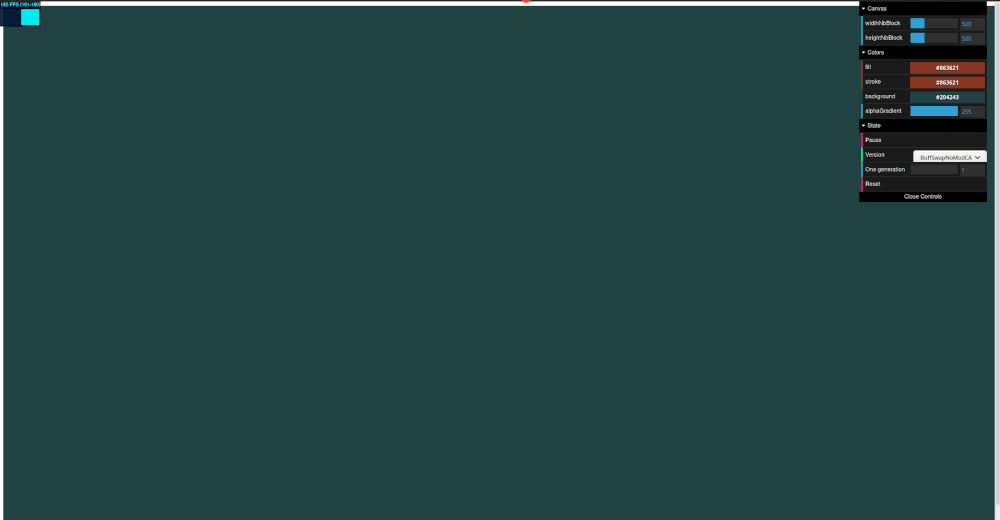

# Triangle of Sierpinski

In this repo, you will find 4 different implementation of Triangle of Sierpinski.
A live demo is available [here](https://evayann.github.io/TriangleSierpinski/).

To draw triangle, you need to place your mouse anywhere on screen and triangle will be created.
